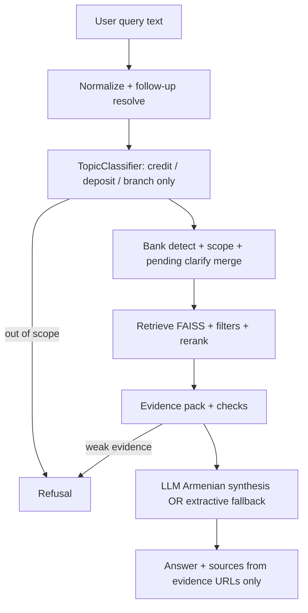
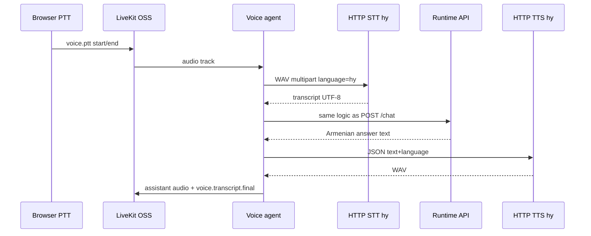

# Armenian Voice AI Banking Support Agent

End-to-end **voice and text** customer-support assistant for **three Armenian retail banks**. Answers are **grounded only in scraped official website content** (credits, deposits, branch locations). The assistant responds in **Armenian**, uses **Google Gemini** for synthesis when configured, and connects to **open-source LiveKit** (self-hosted) for real-time audio with **push-to-talk**.

---

## Summary for reviewers and hiring managers

This repository delivers a **manifest-driven RAG pipeline** (scrape → clean → chunk → FAISS), a **strict runtime** (topic and bank gating, evidence checks, anti-hallucination prompts and post-processing), a **FastAPI** service (`/chat`, health, LiveKit token endpoints), a **React** UI, and a **Python LiveKit agent** that routes microphone audio through **HTTP STT** (Armenian), the same orchestration as text chat, and **HTTP TTS** back to the room. **LiveKit Cloud is not used**; cloud-style URLs are rejected in configuration and in the browser client.

**Private GitHub repo:** If the repository is private, invite reviewer **`HaykTarkhanyan`** with **read** access (per submission instructions).

**Banks in scope (official sites only):** ACBA (`acba`), Ameriabank (`ameriabank`), IDBank (`idbank`) — defined in `manifests/banks.yaml`. Adding another bank is a configuration and re-indexing step, not a fork of core logic.

---

## Product scope and guardrails

| Area | Behavior |
|------|----------|
| **In scope** | Consumer-oriented **credits (loans)**, **deposits**, **branches / addresses / ATMs** for the configured banks, plus tight follow-ups when topic and bank context are already clear. |
| **Out of scope** | Cards, FX, transfers, investment advice, “best bank” recommendations, and other non-product topics → refusal or clarification in Armenian. |
| **Grounding** | Factual claims must follow **retrieved chunks**. The LLM is instructed not to use general world knowledge for rates, URLs, or branch facts; unknown URLs are stripped from model output. If Gemini is unavailable, **extractive fallback** still uses only evidence text. |
| **Multi-turn** | Short follow-ups (e.g. only a **bank name** after “which bank?”) are merged with the **pending question** stored in session state; conversation snippets are passed into synthesis so clarifications stay on-topic. |
| **Voice UX** | Replies are shaped for **spoken Armenian**: short sentences, no markdown headings or bullet lists in the LLM prompt path; source URLs are collected under **«Աղբյուրներ»** for traceability. |

Optional **stricter orchestration** (e.g. require explicit bank name, refuse comparison without two banks in evidence) is configurable in `runtime_config.yaml` under `orchestration:` and is described in `docs/PROMPT_ARCHITECTURE.md`.

---

## System architecture

### Offline data pipeline


### Runtime (text and voice share one path after speech-to-text)



### Voice path (push-to-talk)



**Streaming LLM path (optional, in-process only):** When `behavior.stream_llm_tokens: true` and **`VOICE_RUNTIME_HTTP=0`**, after STT the agent calls `RuntimeOrchestrator.stream_handle` instead of blocking `handle`. **Gemini** uses **`generate_content(..., stream=True)`**; token chunks go to LiveKit topic **`assistant.text.delta`**. On completion, the same **URL scrubbing and evidence rules** as the non-streaming path run once, then **`assistant.text`** carries the final payload (`streamed: true`) and **TTS** runs on that text. The default is **`stream_llm_tokens: false`** for fewer moving parts during demos (HTTP `/chat` path is always non-streaming). Early exits still emit a **single** `assistant.text` with no deltas.

**LiveKit playout:** TTS audio is **decoded to mono PCM**, **resampled to `behavior.livekit_publish_sample_rate`** (default **24 kHz**), then pushed to `AudioSource` in small frames. **`livekit_playout_realtime_pacing`** (default **off**) avoids artificial delays between frames; turn on via **`VOICE_LIVEKIT_PLAYOUT_PACING=1`** if you hear underruns.

**Latency-oriented agent behavior:** STT, RAG (`RuntimeOrchestrator`), and TTS run in a **thread pool** via `asyncio.to_thread` so the LiveKit asyncio loop stays responsive. TTS uses **larger text chunks** (~**480** chars) where possible to cut HTTP round trips; answers are still split on sentence boundaries (including Armenian **։**) when segments are long.

**Frontend live feedback:** After **Connect voice**, the UI shows a **mic level meter** while you hold **Mic**. **Only server Whisper** (HTTP STT) produces the transcript after **Stop & send**; the recognized line appears in chat with an **STT** badge and is exactly what is sent to **`POST /chat`**.

**Local STT server:** `scripts/voice_http_stt_server.py` uses **faster-whisper** with optional **Silero VAD** (when **onnxruntime** loads). Default model size is **`small`** in **`start_stack.ps1`** / env **`VOICE_WHISPER_MODEL`** (use **`base` / `tiny`** for fastest load, **`medium`** for stronger Armenian). On Windows, **`START_STACK.bat` / `start_stack.ps1`** can start STT on **:8088**; set **`VOICE_STT_ENDPOINT`** in `.env`. Transcripts are lightly **normalized** before RAG (`voice/hy_stt_postprocess.py`).

**Local TTS server:** `scripts/voice_http_tts_server.py` uses **edge-tts** (Microsoft). Default speech **rate** is **`+10%`** (env **`VOICE_EDGE_TTS_RATE`**, e.g. **`+0%`** for normal). In some regions, **Armenian `hy-AM-*` voices are not offered** (`NoAudioReceived`); the server **retries with multilingual English voices** that still accept Armenian Unicode. Optional: **`EDGE_TTS_FALLBACK_VOICES`**.

**LiveKit:** Docker image `livekit/livekit-server`, signaling URL such as `ws://127.0.0.1:7880`. JWTs for browser and agent: `GET /api/livekit/token?identity=...` from this API, or offline token generation via `scripts/generate_livekit_token.py`.

**UTF-8:** JSON, HTML, STT/TTS payloads, and LiveKit data-channel messages are handled as UTF-8 so Armenian text is preserved end-to-end.

---

## Models and integration choices

### Embeddings: `Metric-AI/armenian-text-embeddings-2-large`

**Why:** Retrieval quality for **Armenian (hy)** is central to this product. General-purpose English embeddings underperform on inflected Armenian banking copy. This model is used to build dense vectors stored in **FAISS** for fast similarity search over the ingested corpus.

### LLM: Google **Gemini** (default `gemini-2.0-flash` in `llm_config.yaml`)

**Why:** Gemini offers a **long-context** API suitable for packing multiple evidence excerpts with clear numbering, works well with **structured Armenian output** when constrained by system and user prompts (`runtime/llm.py`, `runtime/rag_prompts.py`, `runtime/prompts.py`), and is straightforward to operate via API key (`GEMINI_API_KEY` or `GOOGLE_API_KEY`). **`gemini-1.5-pro`** can be selected via `LLM_MODEL` in `.env` if higher-quality Armenian paraphrase is worth extra latency or quota.

**Reliability:** If the API key is missing or the call fails, the service falls back to a **deterministic extractive** answer built only from retrieved chunks and logs an explicit `llm_error` / `answer_synthesis` field so behavior is auditable.

### Speech: HTTP STT and HTTP TTS (pluggable)

**Why:** Banking organizations may mandate **on-prem STT/TTS**, **vendor APIs**, or **local demos**. The agent speaks to **HTTP endpoints** (Whisper-style STT with `language=hy`, WAV in / JSON out; TTS returning WAV or base64). The repository includes **optional** local reference servers (`scripts/voice_http_stt_server.py`, `scripts/voice_http_tts_server.py`) using **faster-whisper** and **Edge TTS** (Armenian voice, e.g. `hy-AM-AnahitNeural`): **low recurring API cost**, **higher CPU latency** on first Whisper load. **Mock** STT/TTS is supported for CI and UI wiring (`VOICE_USE_MOCK=1` or YAML providers).

### Vector search: **FAISS (CPU)**

**Why:** The corpus is bounded and versioned with the repo; **local** FAISS indexes avoid network dependency at query time and keep latency predictable for demos and evaluation.

**Optional acceleration (config / env):** Ingest YAML (e.g. `validation_manifest_update_hy.yaml`) supports `embedding_device` (`auto` / `cpu` / `cuda` / `mps`), `embedding_batch_size`, and optional `faiss_use_gpu` for GPU-backed search when a GPU build of FAISS is installed. See `.env.example` for `EMBEDDING_DEVICE`, `EMBEDDING_BATCH_SIZE`, `FAISS_USE_GPU`. Index **build** time is dominated by **embedding** the chunks (CPU is slow on large models; GPU helps most there).

---

## Dataset and index (submission default)

| Item | Value |
|------|--------|
| Config | `validation_manifest_update_hy.yaml` |
| Data root | `data_manifest_update_hy/` |
| Index name | `hy_model_index` |

Details: `DATASETS.md`. **Chunk JSONL** (and related cleaned artifacts) are included so the corpus is inspectable. **FAISS vector files** (`faiss.index`, `metadata.jsonl`, `index_info.json`) are **not** committed — run **`build-index`** once after clone (see `data_manifest_update_hy/index/hy_model_index/README.md`). **Raw scraped HTML** under `data_manifest_update_hy/raw_html/` is also omitted; run **`scrape`** locally to regenerate from live sites.

---

## Prerequisites

- **Python 3.10+**
- **Node.js 18+** (web UI)
- **Docker Desktop** (self-hosted LiveKit for voice)
- **Google AI Studio API key** for full Gemini synthesis ([get a key](https://aistudio.google.com/apikey))

---

## Installation (clone → venv → dependencies)

From the repository root:

1. Create and activate a virtual environment:

```bash
python -m venv .venv
```

**Windows (PowerShell):** `.\.venv\Scripts\Activate.ps1`  
**Linux / macOS:** `source .venv/bin/activate`

2. Install the package and dependencies:

```bash
pip install -r requirements.txt
pip install -e ".[dev]"
pip install -e ".[voice]"
```

The `[voice]` extra installs the LiveKit Python SDK for the agent. For the **reference** STT/TTS servers only: `pip install -e ".[voice_local_servers]"`.

3. **Build the retrieval index** (required before `/chat` or voice; generates ignored files under `data_manifest_update_hy/index/hy_model_index/`):

```bash
python -m voice_ai_banking_support_agent.cli --project-root . --config validation_manifest_update_hy.yaml build-index --index-name hy_model_index --banks acba ameriabank idbank --topics credit deposit branch
```

### Environment files

Copy **`.env.example`** to **`.env`** and set at least **`GEMINI_API_KEY`**. For voice, align **`LIVEKIT_URL`**, **`LIVEKIT_API_KEY`**, **`LIVEKIT_API_SECRET`** with `docker/livekit.yaml` (defaults are `devkey` / `secret` for local Docker). Copy **`voice_config.example.yaml`** to **`voice_config.yaml`** (the latter is gitignored). Templates: `.env.backend.example`, `.env.voice.example`, `.env.frontend.example`, `llm_config.example.yaml`.

Optional overrides in `.env`: **`EMBEDDING_MODEL_NAME`**, **`EMBEDDING_DEVICE`**, **`EMBEDDING_BATCH_SIZE`**, **`FAISS_USE_GPU`** / **`FAISS_GPU_ID`** (see comments in `.env.example`).

**Security:** Do not commit `.env` or production `voice_config.yaml`. Default LiveKit keys are for **local development** only.

---

## Running the full application

### One-command stack (Windows / Linux)

| Platform | Command | What starts |
|----------|---------|-------------|
| Windows | `START_STACK.bat` (repo root) | Docker LiveKit, FastAPI on **:8000**, **local STT :8088** and **TTS :8089** if those ports are free, voice agent, Vite on **:5173** (`npm install` on first run). Implemented by `scripts/start_stack.ps1`. |
| Windows | `scripts\run_all.bat` | Same as above. |
| Linux / macOS | `bash scripts/run_all.sh` | Docker Compose, API and voice agent in background, frontend dev server (start STT/TTS manually; see step 3 below). |

On **Windows**, set **`VOICE_STT_ENDPOINT`** / **`VOICE_TTS_ENDPOINT`** in `.env` to match the local servers. On **Linux/macOS**, start the Whisper/Edge scripts yourself or use mock voice.

### Manual order (equivalent steps)

1. `docker compose up -d` (repo root)
2. `python run_runtime_api.py` — API at `http://127.0.0.1:8000` (defaults: `validation_manifest_update_hy.yaml`, `runtime_config.yaml`, `llm_config.yaml`)
3. Optional: `python scripts/voice_http_stt_server.py` and `python scripts/voice_http_tts_server.py`, with `VOICE_STT_ENDPOINT=http://127.0.0.1:8088/transcribe` and `VOICE_TTS_ENDPOINT=http://127.0.0.1:8089/synthesize` in `.env`
4. `cd frontend-react && npm install && npm run dev` — UI typically `http://127.0.0.1:5173`
5. Voice agent (separate terminal; global CLI flags **before** the subcommand):

```bash
python -m voice_ai_banking_support_agent.cli --project-root . --config validation_manifest_update_hy.yaml voice-agent \
  --index-name hy_model_index \
  --runtime-config runtime_config.yaml \
  --llm-config llm_config.yaml \
  --voice-config voice_config.yaml
```

**Voice agent → runtime:** By default the agent calls the same logic as **`POST /chat`** over HTTP (`VOICE_RUNTIME_API_URL`, e.g. `http://127.0.0.1:8000`). For **in-process** orchestration (no HTTP hop; required for **`stream_llm_tokens`** token streaming without duplicating the HTTP streaming contract), set **`VOICE_RUNTIME_HTTP=0`** — see `.env.example` and `voice_config.example.yaml`.

### Verification endpoints

- `GET /health` — process up  
- `GET /ready` — LLM and LiveKit-related configuration surface  
- `GET /api/livekit/config` — JSON with `livekit_url` for the frontend  

### Example `/chat` request

```json
{
  "session_id": "eval-session-1",
  "query": "Ամերիաբանկում ինչ ավանդներ կան",
  "index_name": "hy_model_index",
  "top_k": 8,
  "verbose": true
}
```

### Rebuilding corpus and index

Only if you need a fresh ingest:

```bash
python -m voice_ai_banking_support_agent.cli --project-root . --config validation_manifest_update_hy.yaml scrape --banks acba ameriabank idbank --topics credit deposit branch
python -m voice_ai_banking_support_agent.cli --project-root . --config validation_manifest_update_hy.yaml build-index --index-name hy_model_index --topics credit deposit branch
```

Omitting **`--banks`** on `build-index` rebuilds the index from **all** `*_chunks.jsonl` files under the manifest’s `chunks_dir` (recommended after expanding `manifests/banks.yaml` so no bank is dropped). Run **`build-index` again** after any embedding model or dimension change so `embedding_dim` matches the index.

**Windows note:** `run_runtime_api.py` and the API module set **`TRANSFORMERS_NO_TF=1`** and default **`PROTOCOL_BUFFERS_PYTHON_IMPLEMENTATION=python`** before loading **sentence-transformers**, avoiding common **TensorFlow / protobuf** crashes on first `/chat`. Use `python run_runtime_api.py` as the entrypoint, or set the same variables before `uvicorn` if you start the app another way.

If **`ImportError: cygrpc`** (gRPC) or **`pydantic_core._pydantic_core`** / **`cryptography` DLL** errors appear after `pip install -U`, reinstall pinned stacks: **`pip install -r requirements.txt`** then **`pip install -e ".[voice,voice_local_servers]"`** (see top of `requirements.txt` for `grpcio` / `cryptography` / `pydantic` pins). **LiveKit Docker** image is pinned in `docker-compose.yml` (`livekit/livekit-server:v1.9.4`); run **`docker compose pull`** after pulling this repo.

---

## Automated tests

```bash
python -m pytest tests -m "not slow" -q
```

The `slow` suite (session-scoped client + full embedding load) is in `tests/test_submission_e2e_chat.py` and can be run with `pytest -m slow` or by path. Typical CI-style runs stay on `not slow`; manual evaluation with a real `GEMINI_API_KEY` incurs **low** API cost for short queries.

---

## Voice pipeline (architecture, reliability, troubleshooting)

**End-to-end flow:** Browser **publishes the local mic track first**, then sends `voice.ptt` `start` → agent spawns a **fresh LiveKit `AudioStream` consumer** for that participant (buffers PCM only while `start` is active) → on `end`, agent runs **STT → same `POST /chat` as text** → publishes full **`assistant.text`** for the UI → **`prepare_text_for_tts`** strips URLs / «Աղբյուրներ» / markdown links for **TTS only** (English words inside Armenian are kept) → assistant audio plays → **`voice.state: idle`** is always sent in a **`finally`** block so the next turn cannot stay stuck in “processing”.

**Why the second voice turn used to fail:** The mic consumer was tied to a **single** `async for` over `AudioStream`. After the browser **unpublished** the mic between turns (or the SDK closed the stream), that loop **ended** and the task finished. **`track_subscribed` does not fire again** for the same session, so **no audio was buffered** on turn 2+. **Fix:** cache the remote track on subscribe, and on **every** PTT **`start`** cancel any old consumer and **start a new** `AudioStream` reader; **poll** up to `mic_track_wait_seconds` if the track is not subscribed yet. The React client now **publishes the mic before** sending `start` to avoid a race.

**Second turn “nothing happens” (no error):** The agent used to flip **`_ptt_recording` off before** waiting for trailing frames, while the browser keeps sending audio for **~220 ms** after `voice.ptt` `end` and only then **unpublishes** the mic. That **dropped the tail** of every turn; short second utterances could fall **below the minimum PCM size**, exit early, and only return to **idle** — so the UI looked “stuck” between *Recognizing* and *Ready* without a clear error. **Fix:** keep recording **on** during **`pcm_trail_pause_seconds`** (default **0.30 s**, must cover the client unpublish delay), **then** drain the buffer. If audio is still too short, the agent now publishes **`voice.state` error / `audio_too_short`**. Tune with **`VOICE_PCM_TRAIL_PAUSE_SECONDS`** (e.g. **0.35**) if needed.

**Mic level meter “dead” on the second PTT:** Reusing the same `LocalAudioTrack` after `unpublishTrack` often leaves the underlying `MediaStreamTrack` **ended**, so the Web Audio analyser gets **no samples**. The UI now **stops** the local track after each **Stop & send** and **creates a fresh mic track** on the next **Mic** press so the meter keeps working.

**Voice vs text chat (same brain):** With default `route_through_runtime_api`, each voice turn calls the same **`POST /chat`** handler as the composer, with the same **`top_k`** (`behavior.chat_top_k` / env `VOICE_CHAT_TOP_K`, default **8** — keep in sync with `App.jsx`). Grounding and refusal rules are identical; only **TTS** applies `prepare_text_for_tts` (tables → short Armenian cue, decimal commas like `22,5` → spoken “ամբողջ”, a few banking abbreviations, no URL reading). The **full** answer (including tables and sources) stays in the chat bubble.

**Single transcript source:** The React HUD no longer uses browser **Web Speech API** (it disagreed with Whisper). **Whisper (HTTP STT)** is the only recognition path; the **STT** chat line is exactly what is sent to `/chat`.

**Faster TTS:** Local `voice_http_tts_server.py` defaults to Edge **`rate=+10%`** (override with **`VOICE_EDGE_TTS_RATE`**, e.g. `+0%`). LiveKit playout uses **`livekit_playout_realtime_pacing: false`** by default so frames are not artificially throttled; TTS chunks are larger (**~480** chars) for fewer HTTP round trips.

**Timeouts:** STT, `/chat`, streaming LLM chunks, per-chunk TTS, and full stream turns use `asyncio.wait_for` with values from `voice_config` / `.env` (`VOICE_STT_TIMEOUT_SECONDS`, `VOICE_RUNTIME_API_TIMEOUT_SECONDS`, `VOICE_TTS_TIMEOUT_SECONDS`). Failures publish `voice.state: error` then **always** `idle`.

**Debugging:** Logs include `voice_turn id=<turn_id> stage=... elapsed_ms=...` for each turn. Search the voice agent console for `voice_turn` or `Mic AudioStream ended`.

**`WinError 10061` / connection refused on :8088:** Nothing is listening — the STT window exited, never started, or is still downloading the Whisper model in the background. Open the **STT** console for errors; run `python scripts/voice_http_stt_server.py` manually if needed. **`START_STACK.bat`** now waits for `http://127.0.0.1:8088/health` (up to several minutes on first **medium** model load) and aborts with a clear error if STT never binds.

**Manual QA (repeated voice):** Connect LiveKit voice → ask **five** separate questions via PTT → after each answer, UI returns to **Ready**; disconnect and reconnect once; confirm STT/TTS env endpoints set (`VOICE_STT_ENDPOINT`, `VOICE_TTS_ENDPOINT`).

**Recommended local stack (Armenian banking):** **`faster-whisper`** with model **`medium`** or **`large-v3`** (`VOICE_WHISPER_MODEL`, trade-off: accuracy vs CPU) for STT; **`edge-tts`** with **`hy-AM-AnahitNeural`** and automatic multilingual fallbacks for TTS. Both stay behind the existing **HTTP** `STTProvider` / `TTSProvider` contracts so you can swap in a hosted API later without changing the agent loop.

---

## Operational notes and limitations

- **Scrapers** depend on live HTML; site redesigns may require manifest or parser updates.  
- **Branch listings** may be incomplete if banks do not publish all locations in crawled pages.  
- **Gemini** is subject to quotas; `llm_error` may include rate-limit hints.  
- **Push-to-talk** is not full-duplex streaming STT; transcript appears after each **Stop & send**.  
- **Local Whisper** can be slow on first inference; increase `stt.timeout_seconds` or `VOICE_STT_TIMEOUT_SECONDS` if needed.  
- **WebRTC:** ensure UDP ports in `docker-compose.yml` (e.g. 50000–50050) are allowed through the host firewall when using Docker Desktop on Windows.

---

## Mapping to typical evaluation criteria

| Criterion | Evidence in repository |
|-----------|-------------------------|
| Accuracy and guardrails | `runtime/topic_classifier.py`, `runtime/orchestrator.py`, `runtime/refusal.py`, `runtime/answer_generator.py`, `runtime/rag_prompts.py`; tests under `tests/test_runtime_*.py`, `tests/test_bank_scope.py`, `tests/test_pending_clarify_flow.py` |
| Voice experience | `voice/livekit_agent.py`, `voice/livekit_mic.py`, `voice/tts_speech_prepare.py`, `voice/stt.py`, `voice/tts.py`, `frontend-react/src/App.jsx`; `tests/test_voice_*.py`, `tests/test_tts_speech_prepare.py` |
| Architecture and scalability | `manifests/banks.yaml`, `scrapers/`, `pipelines/`, `indexing/`, `runtime/`, `voice/`; `docker-compose.yml`, `docker/livekit.yaml` |
| Documentation and reproducibility | This README, `DATASETS.md`, example configs (`*.example`, `runtime_config.example.yaml`) |

---

## Documentation map

| Document | Content |
|----------|---------|
| `DATASETS.md` | Dataset layout and index naming |
| `ARCHITECTURE.md`, `RUNTIME_ARCHITECTURE.md`, `LIVEKIT_INTEGRATION_ARCHITECTURE.md` | Deeper design notes |
| `docs/PROMPT_ARCHITECTURE.md` | RAG prompt modules and strict orchestration flags |

---

## Helper scripts (reference)

| Purpose | Windows | Unix |
|---------|---------|------|
| Venv + install | `scripts\setup_env.bat` | `bash scripts/setup_env.sh` |
| LiveKit only | `scripts\run_livekit.bat` | `bash scripts/run_livekit.sh` |
| API only | `scripts\run_backend.bat` | `bash scripts/run_backend.sh` |
| Frontend only | `scripts\run_frontend.bat` | `bash scripts/run_frontend.sh` |
| Voice agent only | `scripts\run_voice_agent.bat` | `bash scripts/run_voice_agent.sh` |
| Stop stack | `STOP_STACK.bat` | — (uses `scripts/stop_stack.ps1`) |

Script comments reference the **canonical commands** in this README where they differ from shortcuts.
