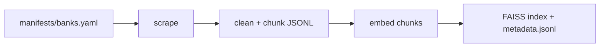
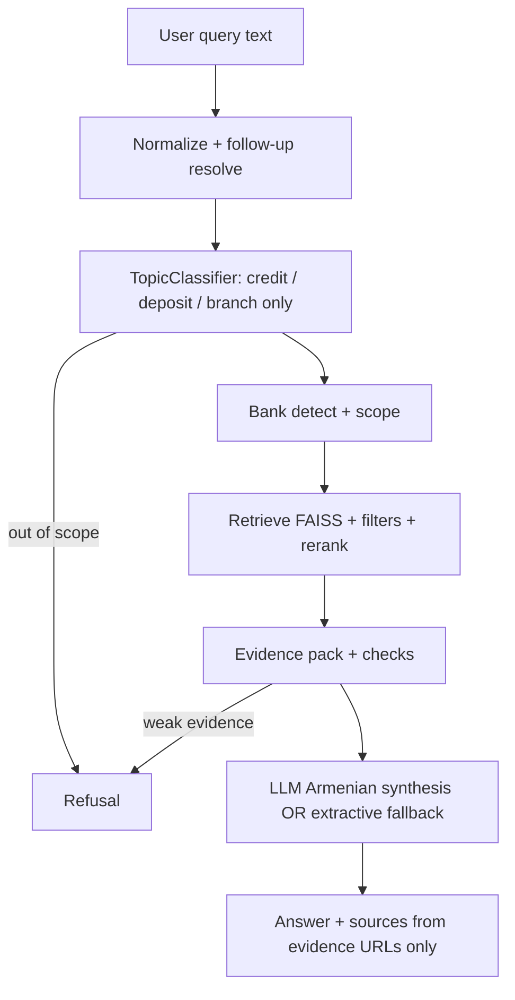
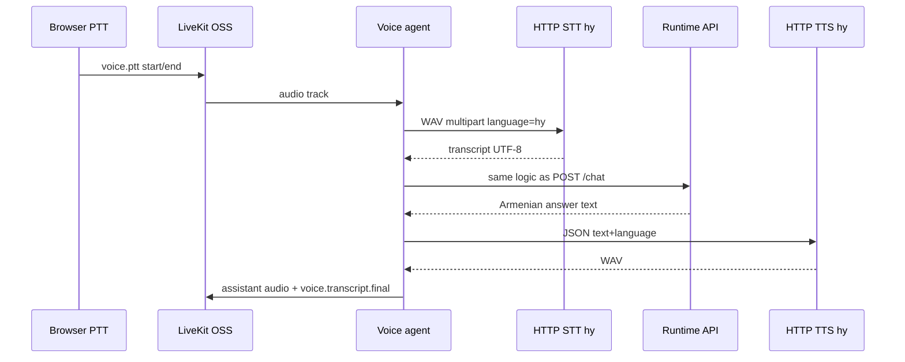

# Armenian Voice AI Banking Support Agent

End-to-end **voice and text** customer-support assistant for **three Armenian retail banks**. Answers are **grounded only in scraped official website content** (credits, deposits, branch locations). The assistant responds in **Armenian**, uses **Google Gemini** for synthesis when configured, and connects to **open-source LiveKit** (self-hosted) for real-time audio with **push-to-talk**.

---

## Summary for reviewers and hiring managers

This repository delivers a **manifest-driven RAG pipeline** (scrape → clean → chunk → FAISS), a **strict runtime** (topic and bank gating, evidence checks, anti-hallucination prompts and post-processing), a **FastAPI** service (`/chat`, health, LiveKit token endpoints), a **React** UI, and a **Python LiveKit agent** that routes microphone audio through **HTTP STT** (Armenian), the same orchestration as text chat, and **HTTP TTS** back to the room. **LiveKit Cloud is not used**; cloud-style URLs are rejected in configuration and in the browser client.

**Banks in scope (official sites only):** ACBA (`acba`), Ameriabank (`ameriabank`), IDBank (`idbank`) — defined in `manifests/banks.yaml`. Adding another bank is a configuration and re-indexing step, not a fork of core logic.

**Private repository:** If this repo is private for submission, add **HaykTarkhanyan** with **read** access in GitHub (Settings → Collaborators). Invites cannot be generated from the codebase.

---

## Product scope and guardrails

| Area | Behavior |
|------|----------|
| **In scope** | Consumer-oriented **credits (loans)**, **deposits**, **branches / addresses / ATMs** for the configured banks, plus tight follow-ups when topic and bank context are already clear. |
| **Out of scope** | Cards, FX, transfers, investment advice, “best bank” recommendations, and other non-product topics → refusal or clarification in Armenian. |
| **Grounding** | Factual claims must follow **retrieved chunks**. The LLM is instructed not to use general world knowledge for rates, URLs, or branch facts; unknown URLs are stripped from model output. If Gemini is unavailable, **extractive fallback** still uses only evidence text. |
| **Voice UX** | Replies are shaped for **spoken Armenian**: short sentences, no markdown headings or bullet lists in the LLM prompt path; source URLs are collected under **«Աղբյուրներ»** for traceability. |

Optional **stricter orchestration** (e.g. require explicit bank name, refuse comparison without two banks in evidence) is configurable in `runtime_config.yaml` under `orchestration:` and is described in `docs/PROMPT_ARCHITECTURE.md`.

---

## System architecture

### Offline data pipeline



### Runtime (text and voice share one path after speech-to-text)



### Voice path (push-to-talk)



**LiveKit:** Docker image `livekit/livekit-server`, signaling URL such as `ws://127.0.0.1:7880`. JWTs for browser and agent: `GET /api/livekit/token?identity=...` from this API, or offline token generation via `scripts/generate_livekit_token.py`.

**UTF-8:** JSON, HTML, STT/TTS payloads, and LiveKit data-channel messages are handled as UTF-8 so Armenian text is preserved end-to-end.

---

## Models and integration choices

### Embeddings: `Metric-AI/armenian-text-embeddings-2-large`

**Why:** Retrieval quality for **Armenian (hy)** is central to this product. General-purpose English embeddings underperform on inflected Armenian banking copy. This model is used to build dense vectors stored in **FAISS** for fast similarity search over the ingested corpus.

### LLM: Google **Gemini** (default `gemini-2.0-flash` in `llm_config.yaml`)

**Why:** Gemini offers a **long-context** API suitable for packing multiple evidence excerpts with clear numbering, works well with **structured Armenian output** when constrained by system and user prompts (`runtime/llm.py`, `runtime/rag_prompts.py`, `runtime/prompts.py`), and is straightforward to operate via API key (`GEMINI_API_KEY` or `GOOGLE_API_KEY`). **`gemini-1.5-pro`** can be selected via `LLM_MODEL` in `.env` if higher-quality Armenian paraphrase is worth extra latency or quota.

**Reliability:** If the API key is missing or the call fails, the service falls back to a **deterministic extractive** answer built only from retrieved chunks and logs an explicit `llm_error` / `answer_synthesis` field so behavior is auditable.

### Speech: HTTP STT and HTTP TTS (pluggable)

**Why:** Banking organizations may mandate **on-prem STT/TTS**, **vendor APIs**, or **local demos**. The agent speaks to **HTTP endpoints** (Whisper-style STT with `language=hy`, WAV in / JSON out; TTS returning WAV or base64). The repository includes **optional** local reference servers (`scripts/voice_http_stt_server.py`, `scripts/voice_http_tts_server.py`) using **faster-whisper** and **Edge TTS** (Armenian voice, e.g. `hy-AM-AnahitNeural`): **low recurring API cost**, **higher CPU latency** on first Whisper load. **Mock** STT/TTS is supported for CI and UI wiring (`VOICE_USE_MOCK=1` or YAML providers).

### Vector search: **FAISS (CPU)**

**Why:** The corpus is bounded and versioned with the repo; **local** FAISS indexes avoid network dependency at query time and keep latency predictable for demos and evaluation.

---

## Dataset and index (submission default)

| Item | Value |
|------|--------|
| Config | `validation_manifest_update_hy.yaml` |
| Data root | `data_manifest_update_hy/` |
| Index name | `hy_model_index` |

Details: `DATASETS.md`. A prebuilt index is included so evaluators can run the stack **without** a long scrape/embed pass unless they choose to rebuild.

---

## Prerequisites

- **Python 3.10+**
- **Node.js 18+** (web UI)
- **Docker Desktop** (self-hosted LiveKit for voice)
- **Google AI Studio API key** for full Gemini synthesis ([get a key](https://aistudio.google.com/apikey))

---

## Installation (clone → venv → dependencies)

From the repository root:

```bash
python -m venv .venv
```

**Windows (PowerShell):** `.\.venv\Scripts\Activate.ps1`  
**Linux / macOS:** `source .venv/bin/activate`

```bash
pip install -r requirements.txt
pip install -e ".[dev]"
pip install -e ".[voice]"
```

The `[voice]` extra installs the LiveKit Python SDK for the agent. For the **reference** STT/TTS servers only: `pip install -e ".[voice_local_servers]"`.

### Environment files

Copy **`.env.example`** to **`.env`** and set at least **`GEMINI_API_KEY`**. For voice, align **`LIVEKIT_URL`**, **`LIVEKIT_API_KEY`**, **`LIVEKIT_API_SECRET`** with `docker/livekit.yaml` (defaults are `devkey` / `secret` for local Docker). Copy **`voice_config.example.yaml`** to **`voice_config.yaml`** (the latter is gitignored). Templates: `.env.backend.example`, `.env.voice.example`, `.env.frontend.example`, `llm_config.example.yaml`.

**Security:** Do not commit `.env` or production `voice_config.yaml`. Default LiveKit keys are for **local development** only.

---

## Running the full application

### One-command stack (Windows / Linux)

| Platform | Command | What starts |
|----------|---------|-------------|
| Windows | `START_STACK.bat` (repo root) | Docker LiveKit, FastAPI on **:8000**, voice agent, Vite on **:5173** (`npm install` on first run). Implemented by `scripts/start_stack.ps1`. |
| Windows | `scripts\run_all.bat` | Same as above. |
| Linux / macOS | `bash scripts/run_all.sh` | Docker Compose, API and voice agent in background, frontend dev server. |

These scripts **do not** start the optional local Whisper/Edge STT/TTS servers; use the commands below or mock voice.

### Manual order (equivalent steps)

1. `docker compose up -d` (repo root)
2. `python run_runtime_api.py` — API at `http://127.0.0.1:8000` (defaults: `validation_manifest_update_hy.yaml`, `runtime_config.yaml`, `llm_config.yaml`)
3. Optional: `python scripts/voice_http_stt_server.py` and `python scripts/voice_http_tts_server.py`, with `VOICE_STT_ENDPOINT=http://127.0.0.1:8088/transcribe` and `VOICE_TTS_ENDPOINT=http://127.0.0.1:8089/synthesize` in `.env`
4. `cd frontend-react && npm install && npm run dev` — UI typically `http://127.0.0.1:5173`
5. Voice agent (separate terminal; global CLI flags **before** the subcommand):

```bash
python -m voice_ai_banking_support_agent.cli --project-root . --config validation_manifest_update_hy.yaml voice-agent \
  --index-name hy_model_index \
  --runtime-config runtime_config.yaml \
  --llm-config llm_config.yaml \
  --voice-config voice_config.yaml
```

### Verification endpoints

- `GET /health` — process up  
- `GET /ready` — LLM and LiveKit-related configuration surface  
- `GET /api/livekit/config` — JSON with `livekit_url` for the frontend  

### Example `/chat` request

```json
{
  "session_id": "eval-session-1",
  "query": "Ամերիաբանկում ինչ ավանդներ կան",
  "index_name": "hy_model_index",
  "top_k": 8,
  "verbose": true
}
```

### Rebuilding corpus and index

Only if you need a fresh ingest:

```bash
python -m voice_ai_banking_support_agent.cli --project-root . --config validation_manifest_update_hy.yaml scrape --banks acba ameriabank idbank --topics credit deposit branch
python -m voice_ai_banking_support_agent.cli --project-root . --config validation_manifest_update_hy.yaml build-index --index-name hy_model_index --banks acba ameriabank idbank --topics credit deposit branch
```

---

## Automated tests

```bash
python -m pytest tests -m "not slow" -q
```

The `slow` suite (session-scoped client + full embedding load) is in `tests/test_submission_e2e_chat.py` and can be run with `pytest -m slow` or by path. Typical CI-style runs stay on `not slow`; manual evaluation with a real `GEMINI_API_KEY` incurs **low** API cost for short queries.

---

## Operational notes and limitations

- **Scrapers** depend on live HTML; site redesigns may require manifest or parser updates.  
- **Branch listings** may be incomplete if banks do not publish all locations in crawled pages.  
- **Gemini** is subject to quotas; `llm_error` may include rate-limit hints.  
- **Push-to-talk** is not full-duplex streaming STT; transcript appears after each **Stop & send**.  
- **Local Whisper** can be slow on first inference; increase `stt.timeout_seconds` or `VOICE_STT_TIMEOUT_SECONDS` if needed.  
- **WebRTC:** ensure UDP ports in `docker-compose.yml` (e.g. 50000–50050) are allowed through the host firewall when using Docker Desktop on Windows.

---

## Mapping to typical evaluation criteria

| Criterion | Evidence in repository |
|-----------|-------------------------|
| Accuracy and guardrails | `runtime/topic_classifier.py`, `runtime/orchestrator.py`, `runtime/refusal.py`, `runtime/answer_generator.py`; tests under `tests/test_runtime_*.py`, `tests/test_bank_scope.py` |
| Voice experience | `voice/livekit_agent.py`, `voice/stt.py`, `voice/tts.py`, `frontend-react/src/App.jsx`; `tests/test_voice_*.py` |
| Architecture and scalability | `manifests/banks.yaml`, `scrapers/`, `pipelines/`, `indexing/`, `runtime/`, `voice/`; `docker-compose.yml`, `docker/livekit.yaml` |
| Documentation and reproducibility | This README, `DATASETS.md`, example configs (`*.example`, `runtime_config.example.yaml`) |

---

## Documentation map

| Document | Content |
|----------|---------|
| `DATASETS.md` | Dataset layout and index naming |
| `ARCHITECTURE.md`, `RUNTIME_ARCHITECTURE.md`, `LIVEKIT_INTEGRATION_ARCHITECTURE.md` | Deeper design notes |
| `docs/PROMPT_ARCHITECTURE.md` | RAG prompt modules and strict orchestration flags |
| `docs/archive/` | Optional historical notes |

---

## Helper scripts (reference)

| Purpose | Windows | Unix |
|---------|---------|------|
| Venv + install | `scripts\setup_env.bat` | `bash scripts/setup_env.sh` |
| LiveKit only | `scripts\run_livekit.bat` | `bash scripts/run_livekit.sh` |
| API only | `scripts\run_backend.bat` | `bash scripts/run_backend.sh` |
| Frontend only | `scripts\run_frontend.bat` | `bash scripts/run_frontend.sh` |
| Voice agent only | `scripts\run_voice_agent.bat` | `bash scripts/run_voice_agent.sh` |
| Stop stack | `STOP_STACK.bat` | — (uses `scripts/stop_stack.ps1`) |

Script comments reference the **canonical commands** in this README where they differ from shortcuts.
